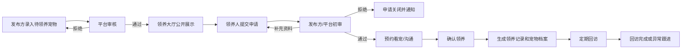
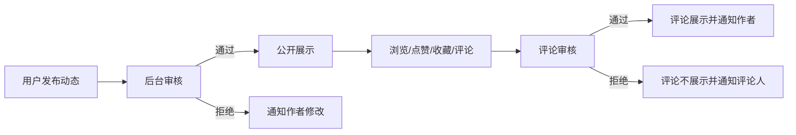
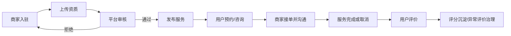
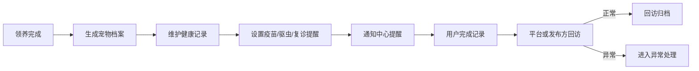
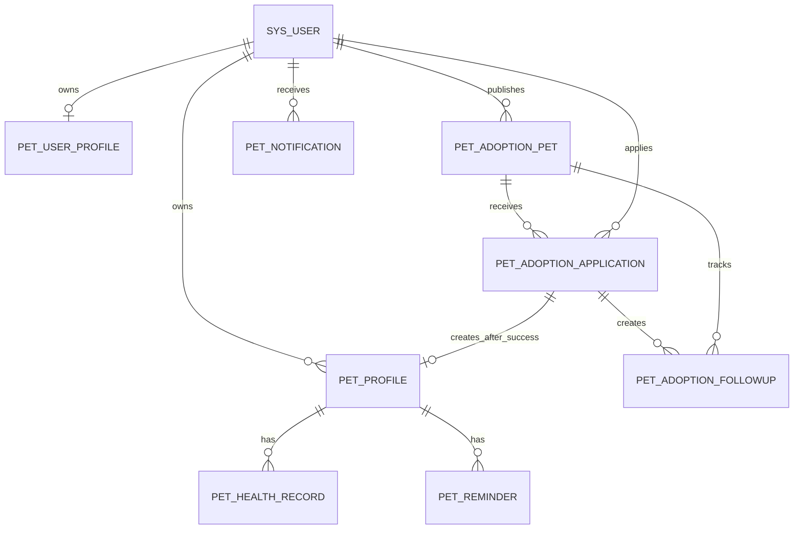

# 宠物领养平台需求分析与系统设计

## 1. 文档说明

本文档面向当前 `ruoyi_pet_adopt` 项目，目标是把“宠物领养平台”从一个可复用的宠物社区/服务底座，整理成业务闭环清晰、可继续开发落地的需求和设计方案。

当前工程已经具备 RuoYi 后台、用户端、宠物档案、社区内容、商家服务、预约咨询、评价、健康档案、提醒、通知和审核等能力。领养业务应在这些能力上扩展，而不是重新做一套独立系统。

## 2. 建设目标

平台要解决三个核心问题：

1. 让待领养宠物可以被规范发布、审核和展示。
2. 让领养人可以完成浏览、申请、沟通、预约看宠、审核、确认领养、回访的完整流程。
3. 让平台管理员能持续管理宠物信息、领养申请、内容安全、服务商家、健康记录和通知反馈。

最终形成四条业务闭环：

| 闭环 | 起点 | 终点 | 核心产物 |
| --- | --- | --- | --- |
| 领养闭环 | 待领养宠物发布 | 领养完成并进入回访 | 宠物领养档案、申请单、审核记录、回访记录 |
| 内容闭环 | 用户发布动态/评论 | 审核后展示或驳回 | 帖子、评论、话题、互动记录 |
| 服务闭环 | 商家入驻/发布服务 | 订单完成并评价 | 商家资质、服务项目、预约单、评价 |
| 照护闭环 | 用户建立宠物档案 | 健康记录和提醒持续维护 | 宠物档案、健康档案、提醒、通知 |

## 3. 现有项目能力梳理

### 3.1 已具备的用户端能力

| 模块 | 现有页面/接口 | 可复用点 |
| --- | --- | --- |
| 登录注册 | `pet-app/src/views/Login.vue`、`Register.vue` | 用户认证、验证码、Token 登录态 |
| 个人主页 | `/app/pet/profile`、`Me.vue` | 昵称、头像、简介、宠物博主申请 |
| 宠物档案 | `/app/pet/pets`、`Pets.vue` | 宠物基础资料、头像、健康状态、寄养标记 |
| 社区内容 | `/app/pet/posts`、`Topics.vue`、`PostDetail.vue`、`PostPublish.vue` | 动态发布、审核、话题、评论、点赞、收藏 |
| 商家服务 | `/app/pet/services`、`Services.vue`、`Merchant.vue` | 商家入驻、服务发布、预约、对话、评价 |
| 健康记录 | `/app/pet/health-records`、`Health.vue` | 疫苗、驱虫、体检等记录和附件 |
| 到期提醒 | `/app/pet/reminders`、`Health.vue` | 提醒时间、状态、通知中心同步 |
| 通知中心 | `/app/pet/notifications`、`Notifications.vue` | 审核结果、预约进度、对话、评价、健康提醒 |
| 寄养授权 | `/app/pet/boarding/*`、`Pets.vue` | 商家请求用户授权复制宠物档案和健康记录 |

### 3.2 已具备的管理端能力

| 模块 | 现有接口/页面 | 可复用点 |
| --- | --- | --- |
| 用户主页管理 | `/manager/pet/profiles/list`、`ruoyi-ui/src/views/pet/profile` | 用户主页、身份状态、内容数据 |
| 宠物档案管理 | `/manager/pet/pets/list`、`ruoyi-ui/src/views/pet/pet` | 按用户和宠物名查看档案 |
| 内容审核 | `/manager/pet/posts/audit`、`/comments/audit` | 帖子、评论待审和历史 |
| 博主认证审核 | `/manager/pet/bloggers/audit` | 认证申请、审核意见、通知 |
| 商家资质审核 | `/manager/pet/merchants/audit` | 入驻审核、启停状态、资质材料 |
| 服务管理 | `/manager/pet/services` | 平台维护或商家维护服务 |
| 预约管理 | `/manager/pet/service-requests/status` | 预约状态流转 |
| 评价治理 | `/manager/pet/reviews/audit` | 商家申请屏蔽评价，平台审核 |
| 健康/提醒查看 | `/manager/pet/health-records/list`、`/reminders/list` | 运营侧查看照护数据 |
| 统计总览 | `/manager/pet/statistics/overview` | 用户、宠物、帖子、商家、服务、提醒数量 |

### 3.3 当前数据基础

当前 SQL 已包含以下宠物业务表：

| 表名 | 用途 |
| --- | --- |
| `pet_user_profile` | 用户主页和宠物博主状态 |
| `pet_profile` | 用户名下宠物档案 |
| `pet_topic`、`pet_post`、`pet_post_media`、`pet_post_topic`、`pet_comment`、`pet_interaction` | 社区内容和互动 |
| `pet_merchant`、`pet_merchant_qualification` | 商家主体和资质材料 |
| `pet_service_item`、`pet_service_request`、`pet_service_message`、`pet_service_review` | 服务、预约、对话、评价 |
| `pet_health_record`、`pet_reminder` | 健康档案和到期提醒 |
| `pet_notification` | 用户通知 |
| `pet_boarding_relation` | 寄养档案授权关系 |
| `pet_audit_record` | 统一审核记录 |

这些表能支撑宠物社区和服务闭环。领养核心闭环还需要新增“待领养宠物、领养申请、回访记录”等业务表。

## 4. 角色与权限设计

| 角色 | 主要目标 | 关键权限 |
| --- | --- | --- |
| 游客 | 浏览公开信息 | 浏览领养大厅、公开动态、服务列表、评价 |
| 注册用户/领养人 | 申请领养和维护宠物 | 提交领养申请、维护个人资料、提交动态、维护宠物档案、预约服务、评价 |
| 发布方 | 发布待领养宠物 | 提交待领养宠物、处理申请、安排看宠、确认交接、发起回访 |
| 商家/机构 | 提供本地宠物服务 | 入驻、提交资质、发布服务、处理预约、申请评价治理、发起寄养授权 |
| 平台管理员 | 运营和风控 | 审核宠物、审核申请、管理用户、商家、内容、评价、统计和通知 |
| 内容审核员 | 保证内容安全 | 审核帖子、评论、举报和异常评价 |

发布方可以先复用当前商家/机构能力，也可以后续拆成独立的“救助机构/个人送养人”角色。第一阶段建议复用 `pet_merchant` 的资质审核逻辑，降低新增权限复杂度。

## 5. 核心业务闭环

### 5.1 领养业务闭环

领养闭环是平台的主业务，必须覆盖发布前、申请中、交接后和回访后的全过程。

关键规则：

1. 待领养宠物必须经过审核后才能公开。
2. 领养申请必须绑定申请人、宠物、联系方式、居住条件、养宠经验和承诺条款。
3. 同一用户对同一只宠物只能存在一个未关闭申请。
4. 宠物进入“已预约/已领养”后，其他申请只能进入候选或关闭状态。
5. 领养完成后，要自动生成领养记录，并可选择复制为领养人的 `pet_profile` 宠物档案。
6. 回访记录必须关联领养记录，异常回访需要进入平台处理队列。

### 5.2 内容社区闭环

社区用于提升平台信任和活跃度，也能沉淀领养后的养宠反馈。

当前工程已实现帖子、评论、话题、点赞、收藏、通知和审核记录。领养业务可以新增“领养故事”“回访日记”“成功案例”等话题，不需要另建内容系统。

### 5.3 商家服务闭环

本地服务用于支撑领养后的洗护、医疗、训练和寄养。

当前工程已具备这条闭环。后续只需要把服务类型中和领养相关的“领养前体检、绝育、疫苗、行为训练、短期寄养”做成推荐入口。

### 5.4 照护与回访闭环

领养不是在交接时结束，平台需要跟踪宠物状态。

当前 `pet_health_record`、`pet_reminder`、`pet_notification` 已能承接健康记录和提醒。新增回访表后，可以把领养后的长期跟踪纳入平台运营。

## 6. 功能需求设计

### 6.1 用户与身份

| 编号 | 功能 | 说明 | 优先级 |
| --- | --- | --- | --- |
| U-01 | 注册登录 | 用户通过账号、密码、验证码完成注册登录 | P0 |
| U-02 | 用户主页 | 维护昵称、头像、简介、封面 | P0 |
| U-03 | 领养人资料 | 补充姓名、联系方式、城市、养宠经验、居住条件 | P0 |
| U-04 | 发布方身份 | 个人送养人或机构提交身份材料 | P1 |
| U-05 | 博主认证 | 复用现有博主申请和审核 | P2 |

### 6.2 领养宠物

| 编号 | 功能 | 说明 | 优先级 |
| --- | --- | --- | --- |
| A-01 | 发布待领养宠物 | 填写名称、物种、品种、年龄、性别、健康状态、疫苗、绝育、性格、来源、照片、领养要求 | P0 |
| A-02 | 审核待领养宠物 | 管理员审核通过后公开展示 | P0 |
| A-03 | 领养大厅 | 按城市、物种、年龄、性别、是否绝育、关键词筛选 | P0 |
| A-04 | 领养详情 | 展示宠物资料、照片、健康说明、领养要求、发布方信息、申请入口 | P0 |
| A-05 | 状态管理 | 草稿、待审核、已发布、已预约、已领养、已下架、审核拒绝 | P0 |
| A-06 | 下架与重发 | 发布方或管理员可下架，修改后重新进入审核 | P1 |

### 6.3 领养申请

| 编号 | 功能 | 说明 | 优先级 |
| --- | --- | --- | --- |
| AP-01 | 提交申请 | 领养人填写申请理由、居住环境、养宠经验、联系方式、承诺条款 | P0 |
| AP-02 | 我的申请 | 用户查看申请状态和审核意见 | P0 |
| AP-03 | 申请审核 | 发布方或管理员处理申请 | P0 |
| AP-04 | 预约看宠 | 审核通过后记录看宠时间、地点和备注 | P1 |
| AP-05 | 确认交接 | 双方确认后宠物状态变更为已领养 | P0 |
| AP-06 | 申请关闭 | 拒绝、撤回、超时、宠物已领养时关闭申请 | P0 |
| AP-07 | 站内通知 | 状态变化写入通知中心 | P0 |

### 6.4 回访与异常处理

| 编号 | 功能 | 说明 | 优先级 |
| --- | --- | --- | --- |
| F-01 | 生成回访计划 | 领养完成后自动生成 7 天、30 天、90 天回访计划 | P1 |
| F-02 | 提交回访记录 | 发布方、管理员或领养人上传文字、图片、健康情况 | P1 |
| F-03 | 异常标记 | 发现退养、失联、健康异常、疑似虐待时标记异常 | P1 |
| F-04 | 异常处理 | 管理员记录处理结论，必要时关闭或升级 | P1 |

### 6.5 社区内容

| 编号 | 功能 | 说明 | 优先级 |
| --- | --- | --- | --- |
| C-01 | 动态发布 | 用户发布养宠经验、领养故事、服务体验 | P1 |
| C-02 | 内容审核 | 帖子和评论审核后展示 | P1 |
| C-03 | 互动收藏 | 点赞、收藏、浏览量统计 | P2 |
| C-04 | 话题运营 | 管理员维护话题，支持领养故事、健康护理等主题 | P2 |

### 6.6 商家与服务

| 编号 | 功能 | 说明 | 优先级 |
| --- | --- | --- | --- |
| S-01 | 商家入驻 | 商家填写资料并上传资质 | P1 |
| S-02 | 资质审核 | 平台审核商家，通过后可发布服务 | P1 |
| S-03 | 服务发布 | 发布洗护、美容、医疗、训练、寄养等服务 | P1 |
| S-04 | 预约咨询 | 用户提交预约，商家处理状态并对话 | P1 |
| S-05 | 服务评价 | 完成后用户评价，商家可申请屏蔽异常评价 | P2 |

### 6.7 通知与审计

| 编号 | 功能 | 说明 | 优先级 |
| --- | --- | --- | --- |
| N-01 | 通知中心 | 审核、申请、预约、评价、提醒、回访统一通知 | P0 |
| N-02 | 未读数量 | 用户端展示未读通知 | P0 |
| N-03 | 审核记录 | 所有审核动作写入 `pet_audit_record` 或业务审核表 | P0 |
| N-04 | 操作日志 | 管理端关键动作接入 RuoYi 操作日志 | P1 |

## 7. 数据库设计

### 7.1 复用表

领养平台继续复用当前已有表：

| 表名 | 在领养业务中的作用 |
| --- | --- |
| `sys_user`、`sys_role`、`sys_menu` | 账号、角色、权限菜单 |
| `pet_user_profile` | 用户展示资料和身份状态 |
| `pet_profile` | 领养完成后形成用户宠物档案 |
| `pet_health_record` | 领养前健康证明、领养后健康记录 |
| `pet_reminder` | 疫苗、驱虫、复诊、回访提醒 |
| `pet_notification` | 申请和审核状态通知 |
| `pet_audit_record` | 通用审核留痕 |
| `pet_post`、`pet_comment`、`pet_topic` | 领养故事和社区内容 |
| `pet_merchant`、`pet_service_item`、`pet_service_request` | 领养后本地服务承接 |

### 7.2 新增表建议

#### `pet_adoption_pet` 待领养宠物

| 字段 | 类型 | 说明 |
| --- | --- | --- |
| `id` | bigint | 主键 |
| `publisher_user_id` | bigint | 发布人 |
| `publisher_type` | varchar(32) | personal/merchant/platform |
| `merchant_id` | bigint | 机构发布时关联商家 |
| `name` | varchar(64) | 宠物名 |
| `species` | varchar(32) | 物种 |
| `breed` | varchar(64) | 品种 |
| `gender` | varchar(16) | 性别 |
| `age_months` | int | 月龄 |
| `city` | varchar(64) | 所在城市 |
| `district` | varchar(64) | 所在区县 |
| `cover_url` | varchar(255) | 封面 |
| `image_urls` | text | 图片列表 |
| `health_status` | varchar(255) | 健康说明 |
| `vaccine_status` | varchar(255) | 疫苗说明 |
| `neutered` | tinyint | 是否绝育 |
| `personality` | varchar(500) | 性格 |
| `source_desc` | varchar(500) | 来源说明 |
| `adoption_requirements` | varchar(1000) | 领养要求 |
| `status` | tinyint | 0草稿 1待审核 2已发布 3已预约 4已领养 5已下架 6拒绝 |
| `audit_reason` | varchar(500) | 审核意见 |
| `adopted_user_id` | bigint | 最终领养人 |
| `adopted_time` | datetime | 领养完成时间 |
| `create_by/create_time/update_by/update_time/remark` | 通用字段 | 审计字段 |

#### `pet_adoption_application` 领养申请

| 字段 | 类型 | 说明 |
| --- | --- | --- |
| `id` | bigint | 主键 |
| `adoption_pet_id` | bigint | 待领养宠物 |
| `applicant_user_id` | bigint | 申请人 |
| `publisher_user_id` | bigint | 发布人 |
| `real_name` | varchar(64) | 真实姓名 |
| `phone` | varchar(32) | 联系电话 |
| `city` | varchar(64) | 所在城市 |
| `housing_type` | varchar(64) | 居住情况 |
| `pet_experience` | varchar(500) | 养宠经验 |
| `apply_reason` | varchar(1000) | 申请理由 |
| `commitment` | varchar(1000) | 领养承诺 |
| `visit_time` | datetime | 预约看宠时间 |
| `visit_address` | varchar(255) | 看宠地点 |
| `status` | tinyint | 0已提交 1初审通过 2待补充 3拒绝 4已撤回 5已预约 6已确认领养 7已关闭 |
| `review_reason` | varchar(500) | 审核意见 |
| `create_by/create_time/update_by/update_time/remark` | 通用字段 | 审计字段 |

#### `pet_adoption_followup` 领养回访

| 字段 | 类型 | 说明 |
| --- | --- | --- |
| `id` | bigint | 主键 |
| `application_id` | bigint | 申请单 |
| `adoption_pet_id` | bigint | 领养宠物 |
| `adopter_user_id` | bigint | 领养人 |
| `publisher_user_id` | bigint | 发布方 |
| `followup_round` | int | 第几次回访 |
| `plan_time` | datetime | 计划回访时间 |
| `actual_time` | datetime | 实际回访时间 |
| `health_status` | varchar(255) | 健康情况 |
| `living_status` | varchar(500) | 生活情况 |
| `image_urls` | text | 回访图片 |
| `status` | tinyint | 0待回访 1已提交 2正常归档 3异常待处理 4已关闭 |
| `abnormal_reason` | varchar(500) | 异常说明 |
| `handle_result` | varchar(500) | 处理结果 |
| `create_by/create_time/update_by/update_time/remark` | 通用字段 | 审计字段 |

### 7.3 核心关系图

## 8. 接口设计

### 8.1 用户端新增接口

| 方法 | 地址 | 说明 |
| --- | --- | --- |
| GET | `/app/pet/adoptions` | 领养大厅列表，支持物种、城市、状态、关键词筛选 |
| GET | `/app/pet/adoptions/{id}` | 领养宠物详情 |
| POST | `/app/pet/adoptions` | 发布方提交待领养宠物 |
| PUT | `/app/pet/adoptions` | 发布方编辑未通过或未发布宠物 |
| DELETE | `/app/pet/adoptions/{ids}` | 发布方删除草稿或已下架记录 |
| POST | `/app/pet/adoptions/{id}/applications` | 用户提交领养申请 |
| GET | `/app/pet/adoption-applications/mine` | 我的申请 |
| GET | `/app/pet/adoption-applications/received` | 我收到的申请 |
| PUT | `/app/pet/adoption-applications/status` | 发布方处理申请状态 |
| POST | `/app/pet/adoption-applications/{id}/confirm` | 确认领养完成 |
| GET | `/app/pet/adoption-followups` | 我的回访记录 |
| POST | `/app/pet/adoption-followups/{id}/submit` | 提交回访 |

### 8.2 管理端新增接口

| 方法 | 地址 | 说明 |
| --- | --- | --- |
| GET | `/manager/pet/adoptions/list` | 待领养宠物管理列表 |
| POST | `/manager/pet/adoptions/audit` | 待领养宠物审核 |
| PUT | `/manager/pet/adoptions/status` | 强制下架、恢复展示 |
| GET | `/manager/pet/adoption-applications/list` | 领养申请管理 |
| PUT | `/manager/pet/adoption-applications/status` | 管理员处理异常申请 |
| GET | `/manager/pet/adoption-followups/list` | 回访管理 |
| PUT | `/manager/pet/adoption-followups/handle` | 异常回访处理 |
| GET | `/manager/pet/statistics/adoption` | 领养业务统计 |

### 8.3 状态流转约束

#### 待领养宠物状态

| 当前状态 | 可流转到 | 触发方 |
| --- | --- | --- |
| 草稿 | 待审核、删除 | 发布方 |
| 待审核 | 已发布、审核拒绝 | 管理员 |
| 审核拒绝 | 待审核、删除 | 发布方 |
| 已发布 | 已预约、已下架 | 发布方/管理员 |
| 已预约 | 已领养、已发布、已下架 | 发布方/管理员 |
| 已领养 | 归档 | 系统/管理员 |
| 已下架 | 待审核、删除 | 发布方/管理员 |

#### 领养申请状态

| 当前状态 | 可流转到 | 触发方 |
| --- | --- | --- |
| 已提交 | 初审通过、待补充、拒绝、撤回 | 发布方/管理员/申请人 |
| 待补充 | 已提交、撤回、关闭 | 申请人/系统 |
| 初审通过 | 已预约、拒绝、关闭 | 发布方/管理员 |
| 已预约 | 已确认领养、拒绝、关闭 | 发布方/管理员 |
| 已确认领养 | 回访中 | 系统 |
| 拒绝/撤回/关闭 | 无 | 终态 |

## 9. 前端页面设计

### 9.1 用户端

| 页面 | 路由建议 | 功能 |
| --- | --- | --- |
| 领养大厅 | `/adoptions` | 筛选、列表、推荐、城市/物种筛选 |
| 领养详情 | `/adoptions/:id` | 宠物资料、图片、领养要求、申请按钮 |
| 发布待领养 | `/adoptions/publish` | 录入待领养宠物，保存草稿或提交审核 |
| 我的申请 | `/adoptions/applications` | 查看申请状态、补充资料、撤回 |
| 收到的申请 | `/adoptions/received` | 发布方处理申请、预约看宠、确认领养 |
| 回访记录 | `/adoptions/followups` | 查看待回访、提交回访资料 |
| 宠物档案 | `/pets` | 继续承载领养后宠物档案、寄养授权 |
| 通知中心 | `/notifications` | 领养、审核、回访、服务消息汇总 |

### 9.2 管理端

| 页面 | 菜单建议 | 功能 |
| --- | --- | --- |
| 待领养宠物审核 | 宠物领养/宠物审核 | 审核发布、下架、查看详情 |
| 领养申请管理 | 宠物领养/申请管理 | 查看申请、处理异常、关闭申请 |
| 回访管理 | 宠物领养/回访管理 | 待回访、异常回访、处理记录 |
| 领养统计 | 宠物领养/数据统计 | 发布数、申请数、成功率、回访异常率 |
| 现有宠物档案 | 宠物领养/宠物档案 | 复用当前页面 |
| 内容审核 | 宠物领养/内容审核 | 复用帖子和评论审核 |

## 10. 通知设计

新增通知类型：

| notice_type | 触发场景 | 接收人 |
| --- | --- | --- |
| `adoption_pet_audit` | 待领养宠物审核通过/拒绝 | 发布方 |
| `adoption_application` | 收到新的领养申请 | 发布方 |
| `adoption_application_status` | 申请状态变化 | 申请人 |
| `adoption_visit` | 预约看宠时间确认 | 申请人、发布方 |
| `adoption_success` | 领养完成 | 申请人、发布方 |
| `adoption_followup_due` | 回访到期 | 申请人、发布方/管理员 |
| `adoption_followup_abnormal` | 回访异常 | 管理员 |

通知继续写入 `pet_notification`，用户端通知中心按类型展示。若后续接入短信、邮件或公众号，仍以站内通知为主记录，外部通道只作为补充。

## 11. 非功能需求

| 类型 | 要求 |
| --- | --- |
| 安全 | 所有写操作必须登录；管理端接口必须校验权限；申请联系方式仅相关方和管理员可见 |
| 审核 | 待领养宠物、内容、商家、评价治理都要有审核记录 |
| 数据一致性 | 确认领养时要在事务中更新宠物状态、申请状态、其他申请关闭、通知发送 |
| 可追溯 | 领养申请、审核、回访、异常处理保留完整时间和操作人 |
| 性能 | 领养大厅按城市、物种、状态、创建时间建立索引；列表分页 |
| 可用性 | 申请提交失败要给出明确原因；状态终态不可重复处理 |
| 隐私 | 领养申请中的电话、住址、真实姓名在公开页面不可展示 |
| 扩展 | 领养、服务、内容模块保持解耦，后续可接第三方地图、短信、支付或合同签署 |

## 12. 开发实施建议

### 第一阶段：补齐领养主链路

1. 新增 `pet_adoption_pet`、`pet_adoption_application` 表和实体、Mapper。
2. 用户端新增领养大厅、详情、发布、我的申请、收到的申请页面。
3. 管理端新增待领养宠物审核和申请管理页面。
4. 通知中心接入领养审核、申请、状态变化通知。
5. 确认领养时自动更新宠物状态，并可生成 `pet_profile`。

### 第二阶段：补齐回访和异常处理

1. 新增 `pet_adoption_followup` 表。
2. 领养完成后生成回访计划。
3. 用户端和发布方可提交回访资料。
4. 管理端处理异常回访。
5. 统计新增成功领养数、回访完成率、异常率。

### 第三阶段：强化运营和服务联动

1. 领养详情推荐附近体检、绝育、寄养、训练服务。
2. 成功案例沉淀到社区话题。
3. 用户宠物档案联动健康提醒。
4. 后台增加数据看板和导出。

## 13. 验收标准

| 场景 | 验收点 |
| --- | --- |
| 发布待领养宠物 | 发布方提交后进入待审核，未审核不公开 |
| 审核通过 | 领养大厅可搜索到，发布方收到通知 |
| 提交申请 | 用户填写申请后，发布方能在收到的申请中看到 |
| 申请处理 | 申请状态变化后，申请人收到通知 |
| 确认领养 | 宠物状态变为已领养，其他未完成申请关闭 |
| 领养后档案 | 系统可为领养人生成宠物档案，并继续维护健康记录 |
| 回访 | 到期后产生提醒，提交后形成回访记录 |
| 异常处理 | 异常回访进入后台处理，处理后留痕 |
| 权限 | 非本人不能编辑别人的发布、申请和宠物档案 |
| 审计 | 审核、确认、关闭、异常处理均有记录可查 |

## 14. 与当前代码的落地关系

当前项目不是空白工程，建议按以下方式复用：

| 现有能力 | 领养业务落点 |
| --- | --- |
| `PetAppController` | 增加用户端领养接口，复用登录用户、分页、通知服务 |
| `PetManagerController` | 增加管理端领养审核、申请管理、回访处理 |
| `PetNotificationService` | 统一创建领养通知、回访提醒 |
| `pet_profile` | 领养完成后生成或关联宠物档案 |
| `pet_health_record` | 领养前健康证明、领养后健康记录 |
| `pet_audit_record` | 记录待领养宠物审核、异常回访处理 |
| `pet-app/src/views/Pets.vue` | 后续可与领养完成后的宠物档案联动 |
| `pet-app/src/views/Notifications.vue` | 增加领养相关通知类型展示 |
| `ruoyi-ui/src/views/pet/components/AuditTable.vue` | 可复用为领养宠物审核和回访异常审核基础组件 |

## 15. 结论

宠物领养平台的核心不是单纯展示宠物列表，而是要把“发布、审核、申请、沟通、确认、档案、回访、异常处理”串成闭环。当前工程已经具备用户、权限、通知、审核、宠物档案、健康记录、内容和服务能力，适合在此基础上增量开发领养主链路。

第一阶段应优先做领养宠物、领养申请和审核通知。第二阶段补齐回访和异常处理。第三阶段再把社区内容和本地服务作为领养后的运营支撑。
